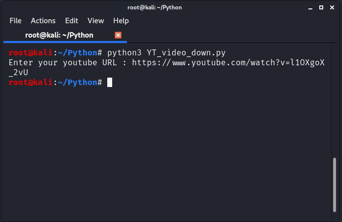
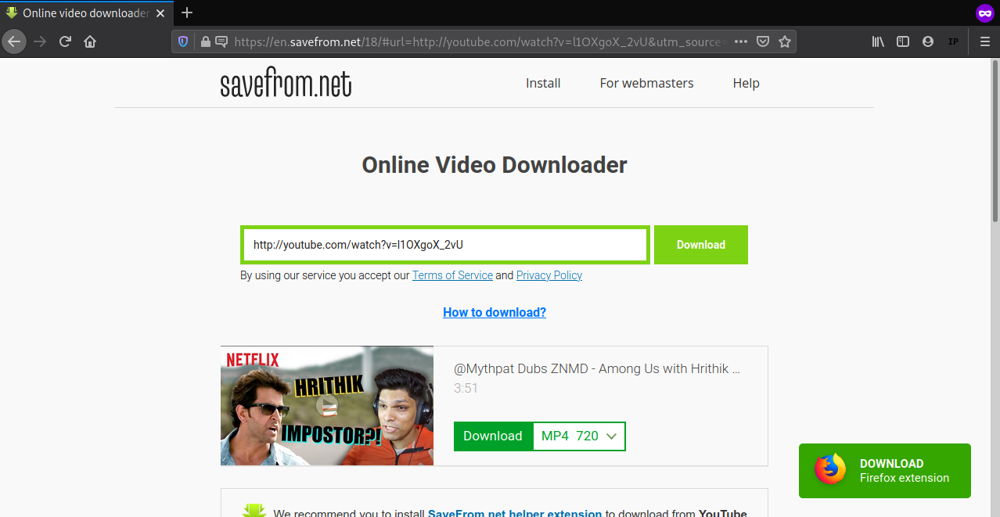

# youtubevideo-downloader

### For dowloading and execution of python visit ::::   [Clich Here](https://github.com/chinmay29hub/ "Detailed procedure")

### Modules used :: webbrowser
     
     
    For Linux   : No need to download, it is shipped when you download python
    
    For Windows : If not installed open the command prompt and hit "python -m pip install webbrowser"
    
    
    
    
### OUTPUT ::::::::::::

1) It will ask you to enter the URL, enter the url and hit enter as shown : 
 
 
 
      
      

2) The program will open the link in your default web browser (in my case its 'Firefox') as shown :

        
  
               
  
    
